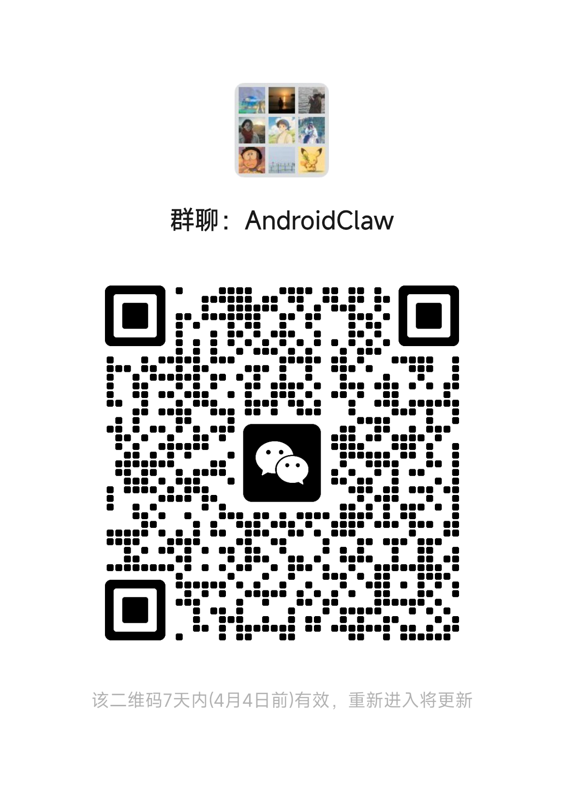

# 📱 AndroidForClaw

[](https://github.com/SelectXn00b/AndroidForClaw/releases/latest)
[](https://www.android.com/)
[](LICENSE)

> **Let AI truly control your Android phone.**

Architecture aligned with [OpenClaw](https://github.com/openclaw/openclaw) (280k+ Stars), bringing full AI Agent capabilities to your phone — see the screen, tap apps, run code, connect platforms.

**[📖 Docs](https://vcn23e479dhx.feishu.cn/wiki/UZtFwM6t9iArPVkMvRccwSran6d)** · **[🚀 Quick Start](#-quick-start)** · **[💬 Community](#-community)**

---

## 🔥 What Can AI Do for You

### 📱 Control Any App

WeChat, Alipay, TikTok, Taobao, Maps… **Anything you can do manually, AI can do too.**

```
You: Open WeChat and send "See you tomorrow" to John
AI:  → Open WeChat → Search John → Type message → Send ✅
```

### 🔗 Cross-App Workflows

```
You: Got an address in WeChat, navigate me there
AI:  → Copy address from WeChat → Open Maps → Search → Start navigation
```

### 🐧 Run Code

Execute commands via Termux SSH (Shell works directly, Python/Node.js need to be installed in Termux):

```
You: Use Python to analyze the CSV in my Downloads folder
AI:  → exec("python3 analyze.py") → Return analysis results
```

### 🌐 Web Search & Fetch

```
You: Search for today's tech news
AI:  → web_search("tech news") → Return titles + links + summaries
```

### 💬 Multi-Platform Messaging

Control your phone AI remotely via Feishu, Discord, and more:

| Channel | Status |
|---------|--------|
| Feishu | ✅ Available (WebSocket real-time, DM/group, 39 Feishu tools) |
| Discord | ✅ Available (Gateway v10, DM/group, permission policies) |
| In-app Chat | ✅ Available |
| Telegram | 🔧 In Development |
| Slack | 🔧 In Development |

Each channel supports **per-channel model override** — pick a dedicated model from your configured providers.

### 🤖 MCP Server (For External Agents)

Built-in MCP Server (port 8399) exposes the phone's accessibility and screenshot capabilities to external agents via the standard MCP protocol:

```
Tools: get_view_tree / screenshot / tap / swipe / input_text / press_home / press_back / get_current_app
```

> This is NOT used by AndroidForClaw itself — it's for external agents like Claude Desktop, Cursor, etc.

### 🧩 Skill Extensions

Search and install new capabilities from [ClawHub](https://clawhub.com), or create your own Skills:

```
You: What skills are available on ClawHub?
AI:  → skills_search("") → Show available skill list
```

---

## 🚀 Quick Start

### Download & Install

Download from the [Release page](https://github.com/SelectXn00b/AndroidForClaw/releases/latest):

| APK | Description | Required? |
|-----|-------------|-----------|
| **AndroidForClaw** | Main app (Accessibility Service, Agent, Gateway) | ✅ Required |
| **BrowserForClaw** | AI Browser (web automation) | Optional |

> Termux should be installed separately from [F-Droid](https://f-droid.org/packages/com.termux/) (don't use Play Store version).
>
> Termux is optional: without it, basic shell commands work (`ls`, `cat`, `curl`, `input`, etc.). With it, you get a full Linux environment (bash, python, git, apt).

### 3 Steps to Get Started

1. **Install** — Download and install AndroidForClaw
2. **Configure** — Open the app, enter an API Key (or skip to use built-in Key), enable Accessibility + Screen Capture permissions
3. **Chat** — Talk directly in the app, or send messages via Feishu/Discord

> 💡 First launch opens a setup wizard automatically. Default: OpenRouter + MiMo V2 Pro. One-click skip supported.

### Termux Setup (Optional)

The app has two exec layers, auto-routed as needed:

| Tool | Implementation | Without Termux | With Termux |
|------|----------------|---------------|-------------|
| **Built-in Shell** | `ProcessBuilder` + `sh -c` | ✅ Basic commands work (`ls`, `cat`, `curl`, `input`, etc.) | ✅ |
| **Termux SSH** | SSH connection pool → Termux sshd | ❌ | ✅ Full Linux environment (bash, python, nodejs, git, apt) |

Without Termux: basic shell commands work, screenshot/tap/input operations available.
With Termux: additionally get Python/Node.js runtime, package manager, full toolchain.

**Settings → Termux Config**, follow the wizard:

1. Install Termux (F-Droid version)
2. Generate SSH key (one-click in app)
3. Run `termux-setup-storage` in Termux
4. `pkg install -y openssh`
5. Copy key config command and execute
6. `sshd`
7. App auto-verifies connection

---

## 🏗️ Architecture

```
846 Kotlin source files · 167,000+ lines of code · 10 modules
```

```
┌──────────────────────────────────────────┐
│  Channels                                 │
│  Feishu · Discord · In-app Chat          │
├──────────────────────────────────────────┤
│  Agent Runtime                            │
│  AgentLoop · 65 Tools · 27 Skills ·       │
│  Context Management (4-layer) · Memory    │
├──────────────────────────────────────────┤
│  Providers                                │
│  OpenRouter · MiMo · Gemini · Anthropic · │
│  OpenAI · Custom                          │
├──────────────────────────────────────────┤
│  Android Platform                         │
│  Accessibility · Termux SSH · device tool │
│  MediaProjection · BrowserForClaw          │
└──────────────────────────────────────────┘
```

### Core Features

| Feature | Description |
|---------|-------------|
| **Playwright Mode** | Screen ops aligned with Playwright — `snapshot` gets UI tree + ref → `act` operates elements |
| **Unified exec** | Auto-routes to Termux SSH (connection pool + activity timeout + auto-reconnect) or built-in Shell |
| **Context Management** | 4-layer protection aligned with OpenClaw: limitHistoryTurns + tool result trimming + budget guard |
| **Model Smart Routing** | Model ID normalization + Fallback Chain + API Key rotation + Allowlist/Blocklist |
| **Session Isolation** | Each session has independent AgentLoop, multi-session parallel without interference; 30-day auto-cleanup |
| **Skill System** | 27 built-in Skills editable on device, ClawHub online installation |
| **Multi-model** | MiMo V2 Pro · DeepSeek R1 · Claude Sonnet 4 · Gemini 2.5 · GPT-4.1 |
| **MCP Server** | Expose accessibility/screenshot to external agents (port 8399, Streamable HTTP) |
| **Per-channel Model** | Each messaging channel can independently select a model |
| **Steer Injection** | Inject messages into a running Agent Loop mid-run via Channel |
| **Termux SSH** | Connection pool reuse + IGNORE keepalive + activity timeout (no timeout if has output) + auto-reconnect |

---

## 📋 Full Capability Table

### 🔧 General Tools (16)

| Tool | Function |
|------|----------|
| `device` | Screen ops: snapshot / tap / type / scroll / press / open (Playwright mode) |
| `read_file` | Read file contents |
| `write_file` | Create or overwrite files |
| `edit_file` | Precise file editing (diff mode) |
| `list_dir` | List directory contents |
| `exec` | Execute commands (Termux SSH / built-in Shell) |
| `web_search` | Brave search engine |
| `web_fetch` | Fetch web page content |
| `javascript` | Execute JavaScript (QuickJS) |
| `tts` | Text-to-speech |
| `skills_search` | Search ClawHub skills |
| `skills_install` | Install skills from ClawHub |
| `config_get` | Read config entries |
| `config_set` | Write config entries |
| `memory_search` | Semantic memory search |
| `memory_get` | Read memory snippets |

### 📱 Android-specific Tools (10)

| Tool | Function |
|------|----------|
| `device` | Unified device ops (screenshot, tap, swipe, input, Home, back, etc.) |
| `list_installed_apps` | List installed apps |
| `install_app` | Install APK |
| `start_activity` | Launch Activity |
| `feishu_send_image` | Send image via Feishu |
| `eye` | Camera capture |
| `log` | View system logs |
| `stop` | Stop Agent |

### 🦊 Feishu Tools (39)

| Category | Tools |
|----------|-------|
| Docs | Get / Create / Update / Media / Comments |
| Wiki | Spaces / Nodes |
| Drive | File operations |
| Bitable | Apps / Tables / Fields / Records / Views |
| Tasks | Tasks / Task lists / Subtasks / Comments |
| Group Chat | Group management / Member management |
| Permissions | Check / Grant / Revoke |
| Urgency | Send urgency / Apply urgency |
| Calendar | Calendars / Events / Participants / Free-busy |
| Messages | Send / Get / Topic messages / Search / Resources / Bot images |
| Search | Search docs/Wiki |
| Common | Get user / Search users |
| Media | Image upload |
| Sheets | Spreadsheet operations |

### 🧩 27 Skills

| Category | Skills |
|----------|--------|
| Feishu Suite | `feishu` · `feishu-doc` · `feishu-wiki` · `feishu-drive` · `feishu-bitable` · `feishu-chat` · `feishu-task` · `feishu-perm` · `feishu-urgent` · `feishu-calendar` · `feishu-common` · `feishu-im` · `feishu-search` · `feishu-sheets` |
| Search & Web | `browser` · `weather` · `lark-cli` |
| Skill Management | `clawhub` · `skill-creator` |
| Dev & Debug | `debugging` · `data-processing` · `session-logs` · `context-security` |
| Config Management | `model-config` · `channel-config` · `install-app` · `model-usage` |

> Skills are stored at `/sdcard/.androidforclaw/skills/` — freely editable, addable, and removable.

### 💬 Messaging Channels

| Channel | Status | Features |
|---------|--------|----------|
| **Feishu** | ✅ Available | WebSocket real-time, group/DM, 39 Feishu tools, streaming card replies, image/file upload |
| **Discord** | ✅ Available | Gateway v10, group/DM, DM policy management, Embed/Button components |
| **In-app Chat** | ✅ Available | Built-in chat UI, multi-session management |
| **Telegram** | 🔧 In Development | — |
| **Slack** | 🔧 In Development | — |

### 🤖 Supported Models

| Provider | Models | Notes |
|----------|--------|-------|
| **OpenRouter** | MiMo V2 Pro, Hunter Alpha, DeepSeek R1, Claude Sonnet 4, GPT-4.1 | Recommended, built-in Key |
| **Xiaomi MiMo** | MiMo V2 Pro, MiMo V2 Flash, MiMo V2 Omni | Direct Xiaomi API |
| **Google** | Gemini 2.5 Pro, Gemini 2.5 Flash | Direct |
| **Anthropic** | Claude Sonnet 4, Claude Opus 4 | Direct |
| **OpenAI** | GPT-4.1, GPT-4.1 Mini, o3 | Direct |
| **Custom** | Any OpenAI-compatible API | Ollama, vLLM, etc. |

> **Default**: OpenRouter + MiMo V2 Pro (1M context + reasoning). Skip the wizard to auto-use built-in Key.

---

## ⚙️ Configuration Reference

`/sdcard/.androidforclaw/openclaw.json`

```json
{
  "models": {
    "providers": {
      "openrouter": {
        "baseUrl": "https://openrouter.ai/api/v1",
        "apiKey": "sk-or-v1-your-key",
        "models": [{"id": "xiaomi/mimo-v2-pro", "reasoning": true, "contextWindow": 1048576}]
      }
    }
  },
  "agents": {
    "defaults": {
      "model": { "primary": "openrouter/xiaomi/mimo-v2-pro" }
    }
  },
  "channels": {
    "feishu": { "enabled": true, "appId": "cli_xxx", "appSecret": "xxx" },
    "discord": {
      "enabled": true,
      "botToken": "your-discord-bot-token",
      "model": "openrouter/xiaomi/mimo-v2-pro"
    }
  }
}
```

See **[📖 Feishu Docs](https://vcn23e479dhx.feishu.cn/wiki/UZtFwM6t9iArPVkMvRccwSran6d)** for detailed configuration.

---

## 🔨 Build from Source

```bash
git clone https://github.com/SelectXn00b/AndroidForClaw.git
cd AndroidForClaw
export JAVA_HOME=/path/to/jdk17
./gradlew assembleRelease
adb install releases/AndroidForClaw-v*.apk
```

---

## 🔗 Related Projects

| Project | Description |
|---------|-------------|
| [OpenClaw](https://github.com/openclaw/openclaw) | AI Agent framework (Desktop) |
| [iOSForClaw](https://github.com/SelectXn00b/iOSForClaw) | OpenClaw iOS client |
| [AndroidForClaw](https://github.com/SelectXn00b/AndroidForClaw) | OpenClaw Android client (this project) |

---

## 💬 Community

<div align="center">

#### Feishu Group

[](https://applink.feishu.cn/client/chat/chatter/add_by_link?link_token=566r8836-6547-43e0-b6be-d6c4a5b12b74)

**[Click to join Feishu Group](https://applink.feishu.cn/client/chat/chatter/add_by_link?link_token=566r8836-6547-43e0-b6be-d6c4a5b12b74)**

---

#### Discord

[](https://discord.gg/rDpaFym2b8)

**[Join Discord](https://discord.gg/rDpaFym2b8)**

---

#### WeChat Group



**Scan to join WeChat group** — Valid for 7 days

</div>

---

## 🔗 Links

- [OpenClaw](https://github.com/openclaw/openclaw) — Architecture reference
- [ClawHub](https://clawhub.com) — Skill marketplace
- [Source Mapping](MAPPING.md) — OpenClaw ↔ AndroidForClaw alignment
- [Architecture Doc](ARCHITECTURE.md) — Detailed design

---

## 📄 License

MIT — [LICENSE](LICENSE)

## 🙏 Acknowledgments

- **[OpenClaw](https://github.com/openclaw/openclaw)** — Architecture inspiration
- **[Claude](https://www.anthropic.com/claude)** — AI reasoning capabilities

---

<div align="center">

⭐ **If this project helps you, please give it a Star!** ⭐

</div>
